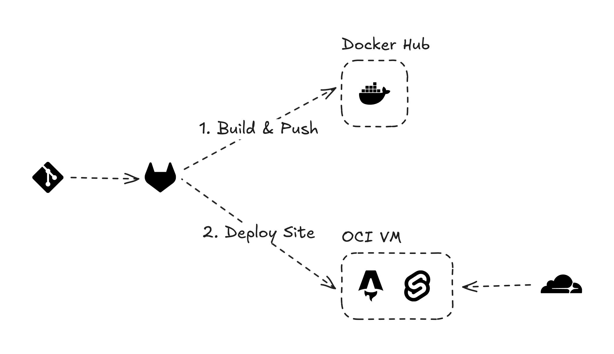

# www.anav.dev

This is my portfolio website which showcases my projects, skills, certifications, experience and blogs. It is a fully static website, with an API endpoint to serve dynamic open graph images. The website is deployed on Oracle Cloud using Docker and GitLab CI.

## Technologies Used

- Astro.js: generates static site and Node.js server
- Svelte: handles complex and interactive components 
- TailwindCSS: CSS framework for styling the website
- Markdown: content source (supports math and diagrams)
- MDX: custom component integration with markdown
- D2: generates technical diagrams during buildtime
- Satori: generates dynamic open graph images during runtime
- Docker: containerizes whole app using Node.js image
- Caddy: reverse proxy running on a Ubuntu virtual machine
- Cloudflare: provides DNS management, SSL encryption and caching  
- GitLab CI: builds Docker image and deploys it to Oracle Cloud

## Learning Resources

- [Add dynamic open graph images to an Astro site](https://dietcode.io/p/astro-og)
- [Add diagrams to an Asto site with D2](https://aaronjbecker.com/posts/adding-d2-diagrams-to-astro)
- [Build an Astro site with Docker](https://docs.astro.build/en/recipes/docker)
