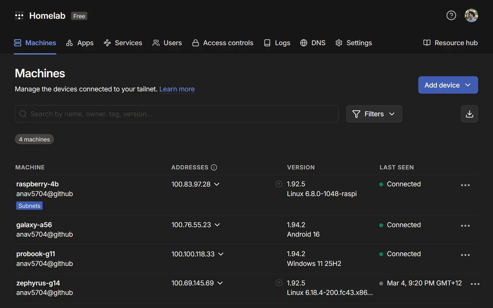
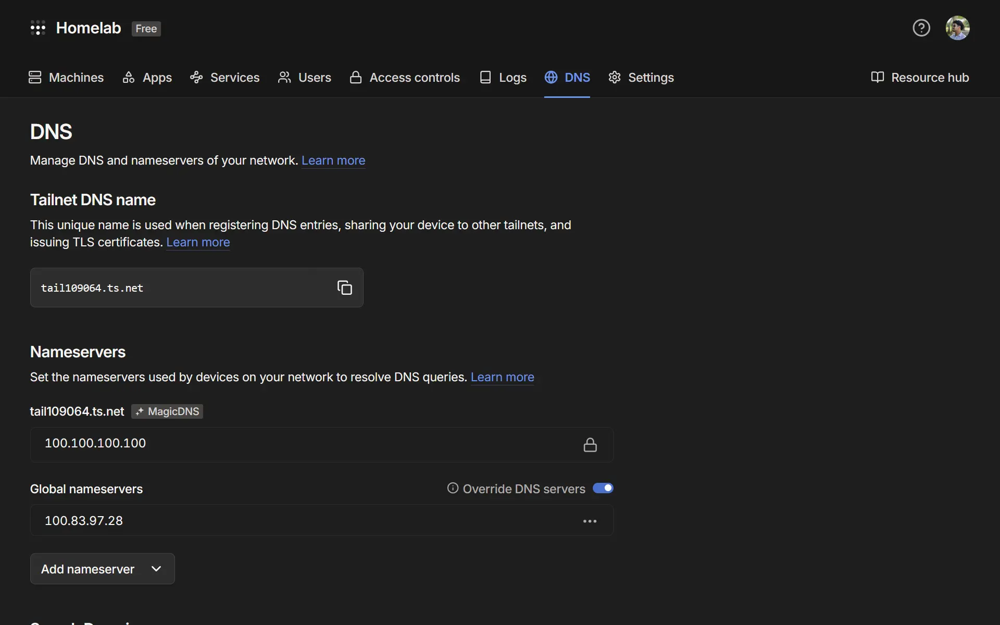

## The Problem

---

Ad blockers are great, until they aren't. Browser extensions only protect one browser on one device, and home DNS sinkholes only protect you while you're home. This post covers how I closed that gap in my homelab by pairing AdGuard Home with Tailscale, so every device I own gets network wide ad and tracker blocking no matter where I am.

## The Stack

---

My homelab setup runs on three pieces: a [Raspberry Pi 4B](https://www.raspberrypi.com/products/raspberry-pi-4-model-b), [AdGuard Home](https://adguard.com/en/adguard-home/overview.html), and [Tailscale](https://tailscale.com/use-cases/homelab). Total hardware cost is around $40 for the Pi, and both software tools are free.

**Raspberry Pi 4B**: This is the homelab server. It sits on my home network, runs 24/7, and hosts both AdGuard Home and the Tailscale daemon. I'm running the 4B with 4GB RAM, which is more than enough for this workload.

**AdGuard Home**: A self-hosted DNS server and ad-blocking sinkhole. It acts as a middleman for all DNS queries on the homelab. It ships with a clean web UI and supports a wide range of blocklists.

**Tailscale**: A zero-config VPN mesh built on WireGuard. Every device on my tailnet gets a stable private IP (in the `100.x.x.x` range) and can talk to every other node, including the Pi sitting in my homelab.



## How It Works

---

Every device on my tailnet is configured to send its DNS queries to the Pi's Tailscale IP (`100.83.97.28`). AdGuard Home is listening on that address from the homelab. When a query comes in, AdGuard checks it against its blocklists. Blocked domains get dropped immediately. Everything else gets forwarded upstream to a real DNS resolver (I use Cloudflare) and the response is returned to the client.

```d2
*.style.border-radius: 6
*.*.style.border-radius: 6
*.style.fill: "#fff"
*.*.style.fill: "#fff"
*.style.font-color: "#444"
*.*.style.font-color: "#444"
*.style.double-border: false

A: Client (anywhere in the world)
B: Tailscale (encrypted tunnel)
C: AdGuard Home (Pi @ 100.83.97.28)
D: Blocked Domain
E: Upstream DNS (e.g. 1.1.1.1)
F: Internet

A -> B: DNS query {style: { animated: true }}
B <-> C {style: { animated: true }}
C -> D: Blocked {style: { animated: true }}
C <-> E: Allowed {style: { animated: true }}
E <-> F {style: { animated: true }}
B -> A: DNS response {style: { animated: true }}
```

The key insight is that "anywhere in the world" part. Because every device connects to AdGuard via the Tailscale tunnel rather than the homelab's LAN IP, it does not matter if I am at home or at university. The tunnel is always up, the Pi is always reachable, and every DNS query goes through it.

## Setting It Up

---

The steps below walk through how I set this up on my homelab: installing AdGuard on the Pi, connecting it to Tailscale, and pointing my devices at it.

### Install AdGuard Home

---

Create a `docker-compose.yml` file for AdGuard Home:

```yaml
services:
  adguardhome:
    image: adguard/adguardhome
    container_name: adguardhome
    restart: unless-stopped
    ports:
      - "53:53/tcp"
      - "53:53/udp"
      - "3000:3000/tcp"
    volumes:
      - ./adguard/work:/opt/adguardhome/work
      - ./adguard/conf:/opt/adguardhome/conf
```

Then start it:

```sh
docker compose up -d
```

On first run, navigate to `http://<pi-local-ip>:3000` to complete the setup wizard. Set your admin port to `80` and DNS port to `53` when prompted.

### Configure Blocklists

---

AdGuard Home comes with a default blocklist. For broader coverage, add community lists under **Filters → DNS blocklists**. A solid starting set:

- [AdGuard DNS filter](https://adguardteam.github.io/AdGuardSDNSFilter/Filters/filter.txt)
- [Steven Black's Hosts](https://raw.githubusercontent.com/StevenBlack/hosts/master/hosts)
- [EasyList](https://easylist.to/easylist/easylist.txt)

### Install and Configure Tailscale

---

Install Tailscale and setup persistent iptables:

```sh
# Install
curl -fsSL https://tailscale.com/install.sh | sh

# Enable IP forwarding
sudo sysctl -w net.ipv4.ip_forward=1
sudo sysctl -w net.ipv6.conf.all.forwarding=1
```

Allow persistent iptables forwarding through the Tailscale interface:

```sh
iptables -I FORWARD -i tailscale0 -j ACCEPT
iptables -I FORWARD -o tailscale0 -j ACCEPT

# Persist rules across reboots
sudo apt install iptables-persistent
sudo netfilter-persistent save
```

### Point Tailscale DNS To AdGuard

---

In the Tailscale admin panel, go to **DNS → Add nameserver → Custom**. Enter the Pi's Tailscale IP (`100.83.97.28`). Enable **Override local DNS** to ensure all connected devices use it.



### Connect Client Devices

---

On any device you want protected, install Tailscale and join your tailnet:

```sh
curl -fsSL https://tailscale.com/install.sh | sh
sudo tailscale up --accept-routes
```

On iOS and Android, install the Tailscale app and sign in. DNS overriding happens automatically once the custom nameserver is set in your account.

## The Result

---

Once everything is running, every device on my tailnet gets ad blocking regardless of physical location. My phone on mobile data, my laptop at university, a friend's machine temporarily added to the network. All of them route DNS through AdGuard Home on the Pi sitting in my homelab. The AdGuard dashboard gives full visibility into what is being blocked across every device, with query volume, top blocked domains, and per-client stats.
