## Guide Overview

---

In this guide, we are going to self-host a Node.js server that will run an AI Chatbot that imitates Batman, for free. We will start off by setting up a GitHub repository. Then we’ll go get out API keys. Finally, we will create the actual Discord bot and add Batman to our server. Along with this, you’re going to learn about APIs and API keys as these are what the whole Discord bot is built on.

## Final Product

---

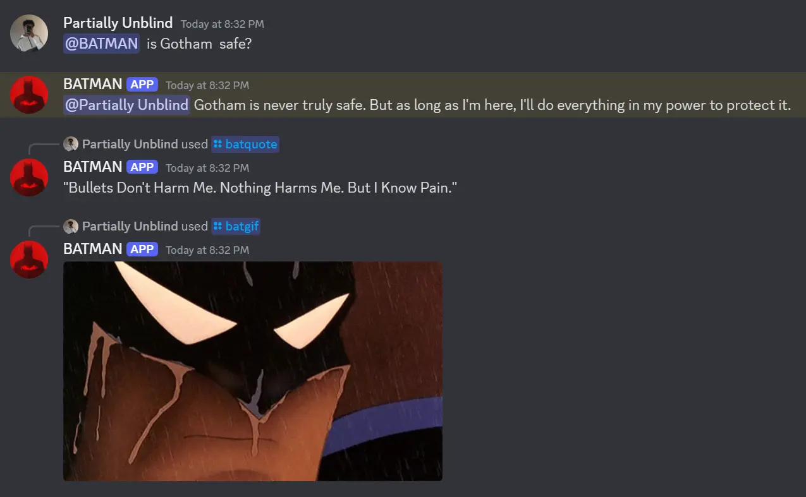

If everything goes smoothly, you will have Batman in your Discord server. You and your friends will be able to chat with him and use some slash commands.

-   **@mention** - in order to get Batman to respond to you, you need to mention him. This is to prevent Batman from responding to every message.
-   **/batgif** - this will fetch and display a random Batman GIF. The Giphy API is being used under the hood as the source of the gifs.
-   **/batquote** - this will display a random Batman quote. I think there are only 10 quotes and all of them are hard-coded. I was lazy.

If you like the idea of having Batman in your server, but aren't sure if its worth setting up, you can join this [Gotham Discord Server](https://discord.gg/K9rMzPudgS) to try it out.

## API And API Keys

---

API stands for Application Programming Interface. Think of an API the interface between different applications, just like how your monitor in the interface between you and your computer. When it is said that an application `exposes` an API, it means that it provides a way for other applications to interact with it. We will be using a Node.js server to interact with the Google Palm AI API, Giphy API and Discord API.

An API key is just a fancy synonym for a password. It is used to authenticate the user and get access to the API. For instance, if you want to use your friends' Wi-Fi hotspot, you will need to get the password from them. Doing so will allow you to access tee internet, while your friend has the ability to see how much data you have used. Similarly, we will use API keys to use services provided by other applications, while they get to monitor our usage.

## Get API Keys

---

We are now going to get API keys for the services we will be using. These API keys are extremely sensitive and should be kept private. I recommend creating a local `keys.txt` file and storing the API keys there. In that file, add the following:

```sh
PALM_AI_API_KEY=""
DISCORD_TOKEN=""
GIPHY_API_KEY=""
```

### Discord Token

---

In order to get a Discord token, you will need to create a new application. Go to the [Discord Developer Portal](https://discord.com/developers/applications) create an account if you don't have one. Then, go to the `Applications` section and create a new application.

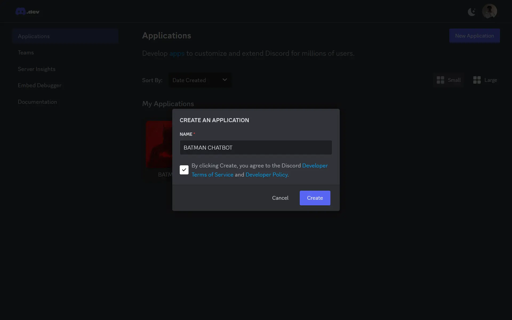

After creating the application, go to the `Bot` section and click on `Reset Token`.

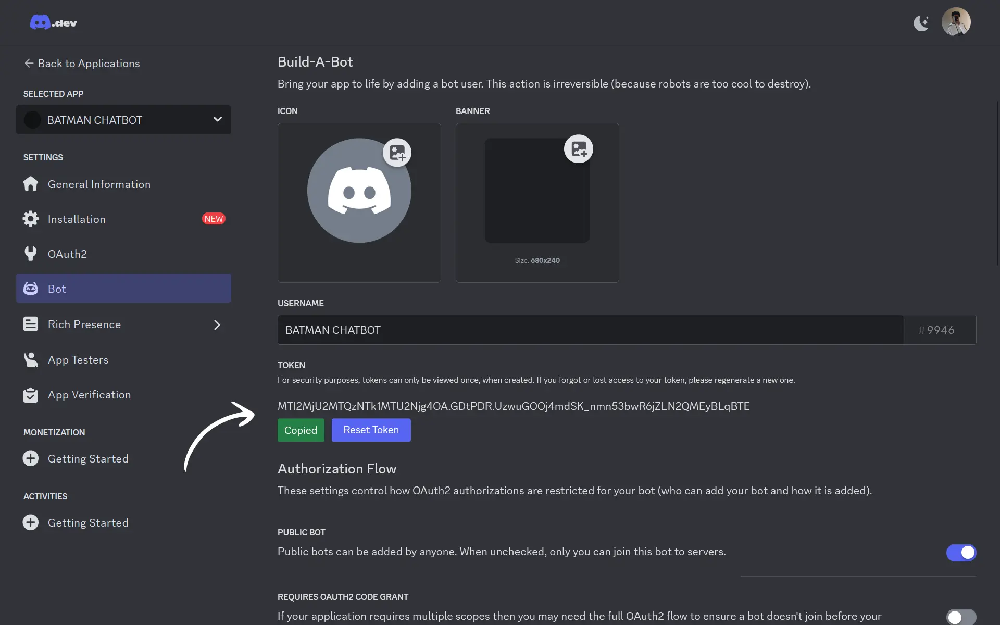

After a new token is generated, copy it and paste it into the `keys.txt` file.

```sh
DISCORD_TOKEN="your-discord-token"
```

Since we are here, let's scroll down and set some settings for the bot. Enable `Public Bot` and `Message Content Intent`. This will allow the bot to send messages in the server.

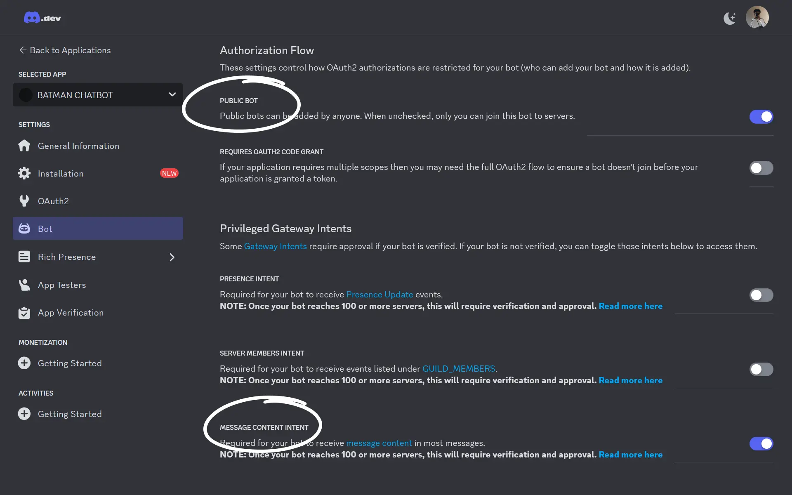

### Gemini API Key

---

I made the Batman Discord Bot using Google Palm AI. It is now know as Google Gemini AI. To get the Gemini API key, go to the [Google AI Studio](https://aistudio.google.com/app/apikey) and click on `Create a API key`.

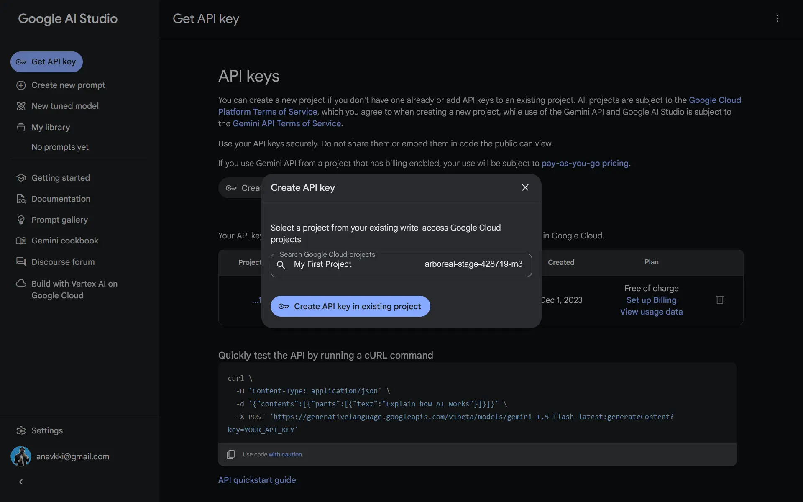

Each key belongs to a specific project. If you do not have a project, create one. Copy the key and paste it into the `keys.txt` file. Despite this being a `Gemini` API, we will still name the variable `Palm AI` as that is what the code expects.

```sh
PALM_AI_API_KEY="your-gemini-api-key"
```

### Giphy API Key

---

You can create a Giphy API key from your [Giphy Developer Dashboard](https://developers.giphy.com/dashboard/). A Giphy account is required for this. While creating the key, you will be given an option to chose either `SDK` or `API`. Choose `API` and proceed.

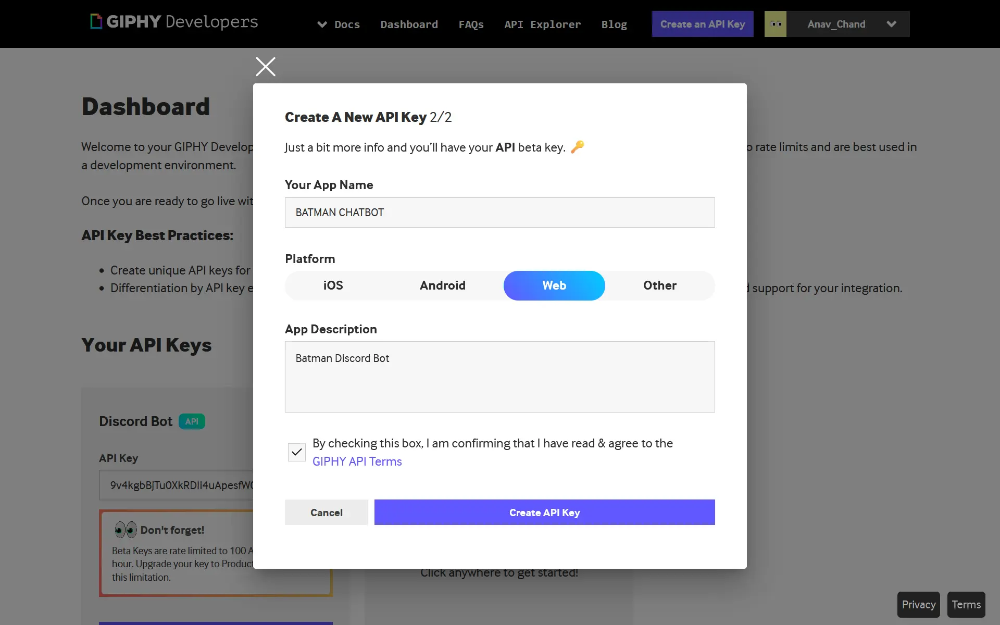

Once you have created the API key, copy it and paste it into the `keys.txt` file. Just note that this time, instead of the API key itself, we are using a URI that has the API key in it.

```sh
GIPHY_API_KEY="https://api.giphy.com/v1/gifs/search?api_key=<your-giphy-api-key>&q=Batman&limit=50"
```

## Prepare Repo

---

You will need to set up a repository on GitHub. If you go not have a [GitHub](https://github.com) account, create one. Then, go to my [Batman Discord Bot repository](https://github.com/anav5704/ai-discord-bot) and fork the repository. This will create your own version of my repo. This is needed so you can go and host it on your own server.

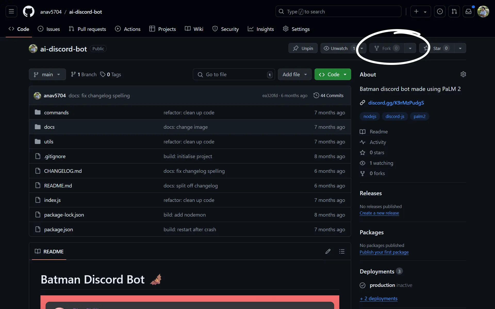

You will be prompted to name the repo, along with a few other details. Give it a relevant name and be sure to select the `Public` option.

## Host On Server

---

Now that we have all the API keys and the repo ready, we can deploy it to a server. A server is basically a computer that's always running a program. We are going to use [Railway](https://railway.app) to deploy our app. They provide manged hosting for Node.js apps. When you sign up, you will be given a $5 credit. After you use that, you will have to upgrade to the [Hobby plan](https://railway.app/pricing). This plan also gives you $5 worth of free usage per month. As long as you plan to use Batman for a small server, like one for your friends, you won't be charged.

### Railway App

---

Go to the [Railway](https://railway.app) website and create an account using GitHub. Then, go to the `Projects` tab and click on `New Project`. Select `Deploy From GitHub Repo` and then select the repo you forked earlier.

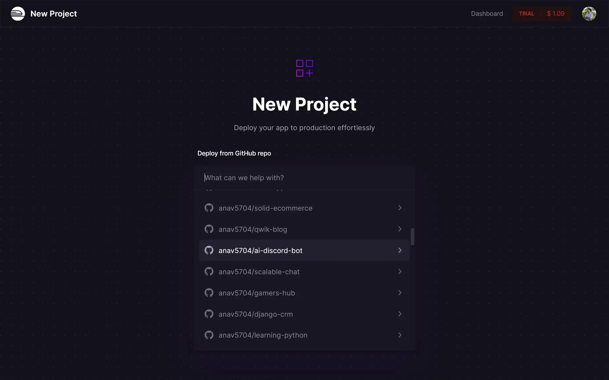

### Add API Keys

---

After selecting a repo, you will be given an option either deploy the app or add variables. Click `Add Variables` and then add the API keys you got from Discord, Gemini and Giphy.

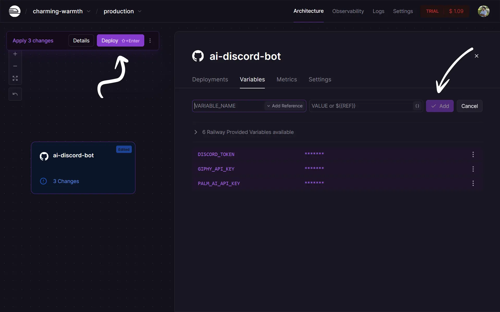

After adding the API keys, you can deploy the app by clicking on `Deploy` on the top left. Then wait for a few seconds while the app builds and deploys.

## Invite Batman

---

Now that we have deployed Batman to Railway, we can invite him to our server. Go back to the [Discord Developer Portal](https://discord.com/developers/applications) and click on the bot you created. Then, click on `Installation` and copy the `Install Link`.

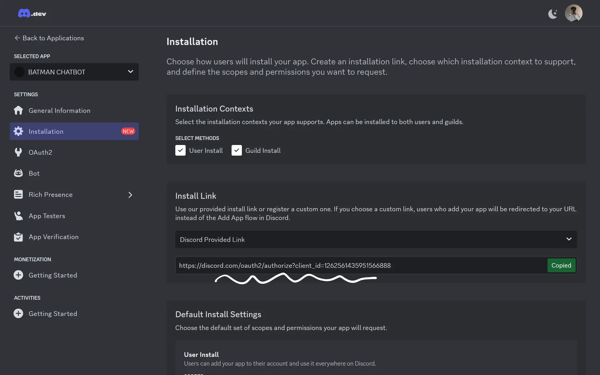

Treat this as a secret. If someone gets hold of this link, they will be able to add Batman to their server. This means they will be using your resources from Railway. This is not ideal as we want to stay within the monthly limits. Paste this link into your browser. You will be prompted to log in and chose a server to install the bot to.

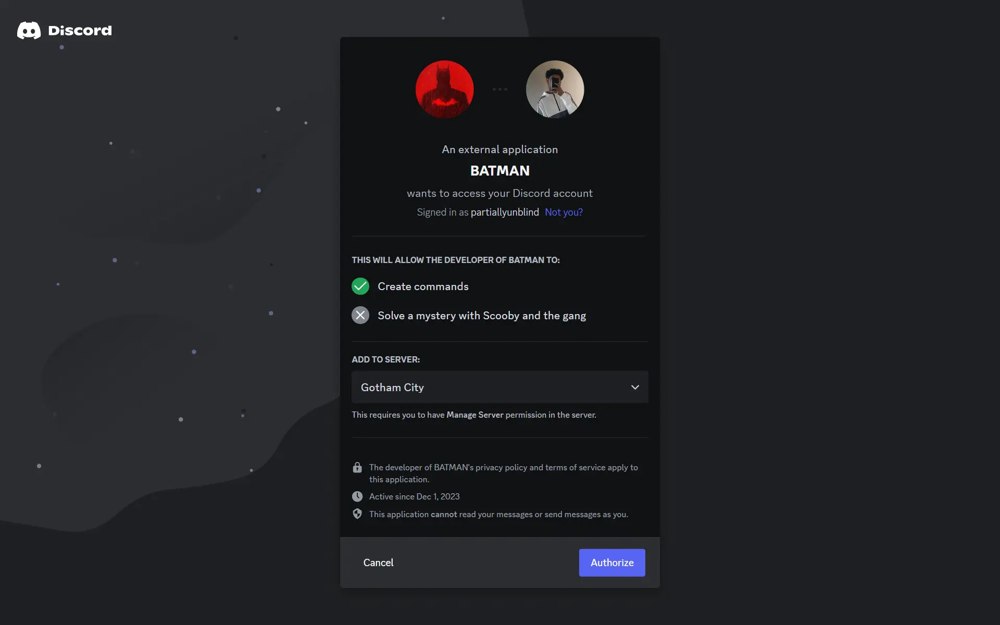

You have successfully deployed Batman and added him to your server.

## Final Thoughts

---

Having Batman in your Discord server will definitely get people talking. It is also just a fun thing to have lying around. Making a Discord bot is one of the more challenging ways of learning Node.js and APIs. This guide did not involve any coding, but if you want to learn how bots work under the hood, I highly recommend building one yourself. You are bound to learn a lot from it, and it will be a great addition to your portfolio.
