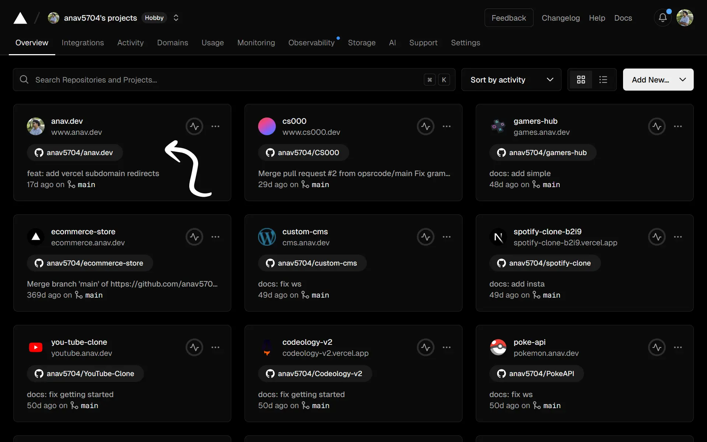

## Introduction

---

Domains names are pretty cool. I think that every developer needs to have one for themselves. You get to host your own personal website at the domain and create an online presence. Subdomains are even cooler. You get to organize your content in a clean and professional way. A common use case for subdomains would be to host personal projects. Another great use case is to setup redirects for personal branding. In this article, I'll guide you through how to setup subdomain to external URL redirects using Vercel.

## Overview

---

Our goal is to setup subdomains for internal website paths and for external social links. This means you will need to own a domain name and a personal website hosted at that domain. If you don't have a domain name, you can directly purchase one on Vercel. This isn't the cheapest option, which is why I buy my domains from [Namecheap](https://www.namecheap.com/) and [point the nameservers to Vercel](https://medium.com/@aozora-med/how-to-set-up-namecheap-domain-on-vercel-2b2313e22342). 

## Configure Redirects

---

The easiest method to configure the redirects is by using Vercels own configuration file. First, create a `vercel.json` file in the root of your personal website. Then, add subdomain redirects like this:

```json
{
    "redirects": [
        {
            "source": "/",
            "has": [
                {
                    "type": "host",
                    "value": "blogs.anav.dev"
                }
            ],
            "destination": "https://anav.dev/blogs"
        }
    ]
}
```

This means if a users visits [blogs.anav.dev](https://blogs.anav.dev), they will get redirected to [anav.dev/blogs](https://anav.dev/blogs). Similarly, we can add redirects for external links:


```json
{
    "redirects": [
        {
            "source": "/",
            "has": [
                {
                    "type": "host",
                    "value": "github.anav.dev"
                }
            ],
            "destination": "https://github.com/anav5704"
        }
    ]
}
```

In this case, if a users visits [github.anav.dev](https://github.anav.dev), they will get redirected to [github.com/anav7504](https://github.com/anav5704). Here is my current subdomain mapping:

| Source                      | Destination               |
|-----------------------------|---------------------------|
| github.anav.dev             | github.com/anav5704       |
| twitter.anav.dev            | twitter.com/anav_webdev   |
| youtube.anav.dev            | youtube.com/@aanaav       |
| linkedin.anav.dev           | linkedin.com/in/aanaav    |
| resume.anav.dev             | dub.sh/anav-resume        |
| projects.anav.dev           | anav.dev/projects         |
| skills.anav.dev             | anav.dev/skills           |
| experience.anav.dev         | anav.dev/experience       |
| blogs.anav.dev              | anav.dev/blogs            |
| research.anav.dev           | anav.dev/research         |

After adding all the redirect rules, you will need to push the code to your remote Git repository so that Vercel can rebuild your website.

## Configure Subdomains

---

Now that we have added the redirect rules, we have to configure the subdomains on Vercel. Go to the [Vercel dashboard](https://vercel.com) and click on your personal website that is linked to your domain.



Then, click on `Domains` on the top right corner of the project page.


Finally, add all the subdomains that you have in your `vercel.json` file.


And with that, we have successfully setup subdomain to internal and external URL redirects on Vercel. Enjoy your clean subdomain redirects.

## Conclusion

---

This article went over how you can setup subdomain to URL redirects on Vercel. The approach we took was editing the `vercel.json` and adding redirect rules to it. I know this isn't the most efficient approach, as this file has to be edited and committed for every change that needs to be made. Despite that, I think it's a simple and straight forward way to manage subdomain redirects and enhance your personal brand. 
