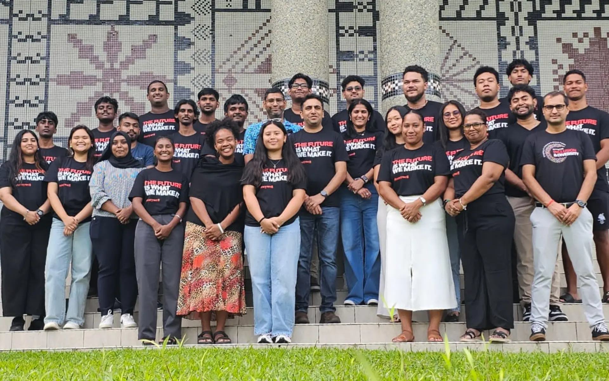

I work within a distributed [SAFe team](https://www.ibm.com/think/topics/scaled-agile-framework), contributing to Data Science and Data Engineering tasks including data preprocessing exploratory data analysis feature engineering, model experimentation, and pipeline development.
