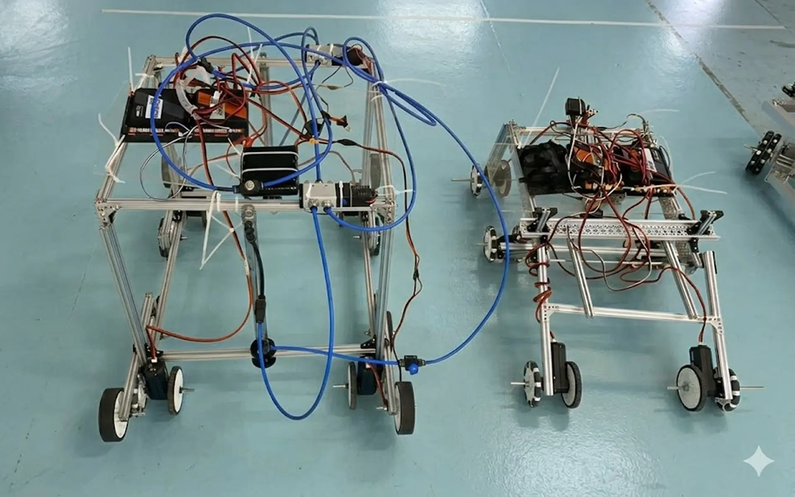

I worked alongside mechanical and electrical engineering students in a robotics team for [ABU Robocon 2026](https://www.usp.ac.fj/usp-stemp/news/robocon-2026-launch-event). I built a computer vision system based on YOLOv8 object detection and an EfficientNet classification.

I developed a symbol classification model using transfer learning with [EfficientNet-B0](https://docs.pytorch.org/vision/main/models/generated/torchvision.models.efficientnet_b0.html). I created a binary classifier by applying data augmentation techniques and class weighting to handle dataset imbalance.

I developed an object detection model using [YOLOv8 Nano](https://docs.ultralytics.com/models/yolov8) for real-time box localization on scrolls. The model outputs bounding box coordinates and confidence scores, which feed directly into the classification pipeline.
