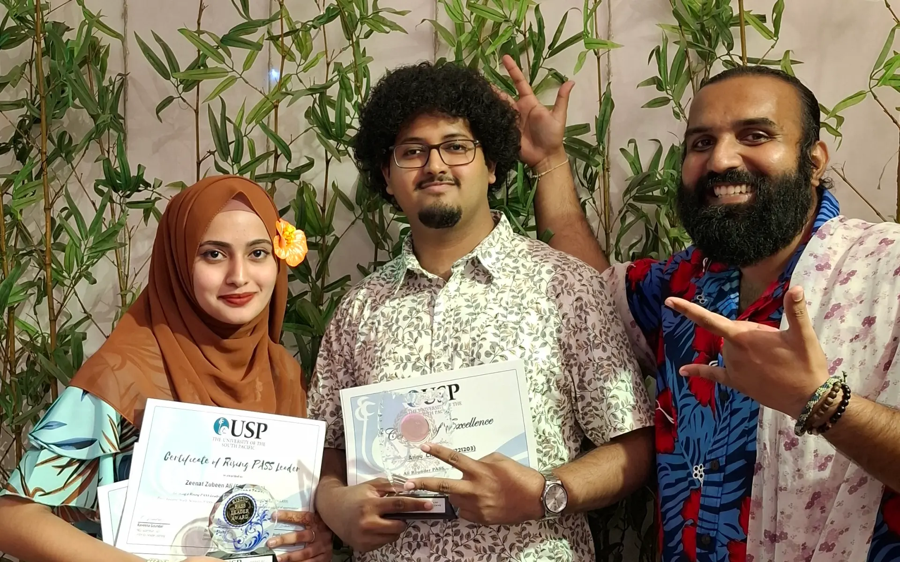

I earned the All-Rounder PASS Leader Award for my work across the wider PASS programme. This included building an attendance app, supporting technical labs, and volunteering at major events such as USP Open Day.

I developed a [mobile app](https://anav.dev/projects/passport) for taking PASS attendance by scanning student ID cards. This completely eliminates the need for paper based attendance and is currently being implemented using a pilot approach in STEMP based courses.

I supported students during labs which were based on Oracle Cloud Infrastructure. I guided students through network configuration, compute provisioning, system configuration and other cloud computing tasks.
