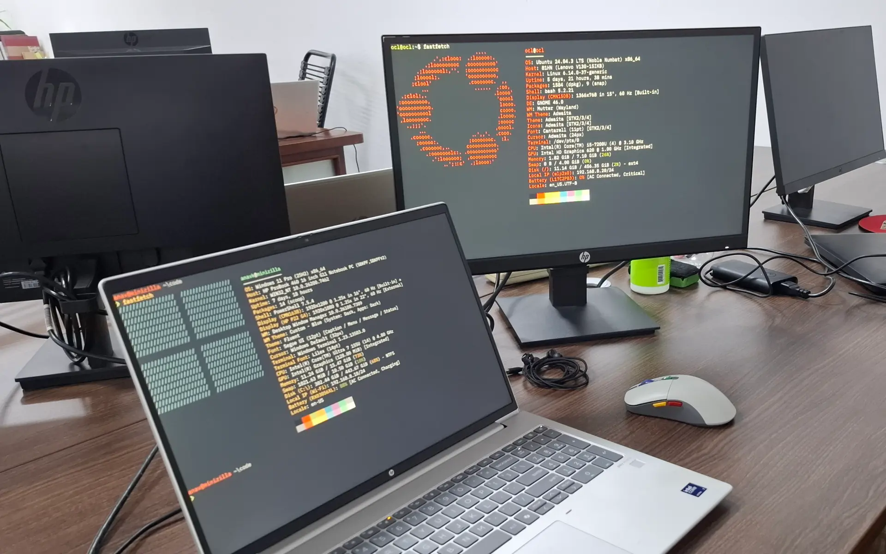

I worked on a major client-facing project and three internal systems, contributing to post-launch work, internal tooling, and workflow automation. This involved shipping features, improving performance, and  fixing issues. 

I supported post-launch development and maintenance of the [Fiji Rugby Union website](https://fijirugby.com). As part of this work, I implemented optimizations that increased overall site performance by ~10% and core web vitals by ~20%.

I contributed to various internal tools. I worked on an attendance and leave management app, helping digitize attendance workflows. I also developed integrations within [Bitrix ERP](https://www.bitrix24.com), including a task timer and quality logger.
