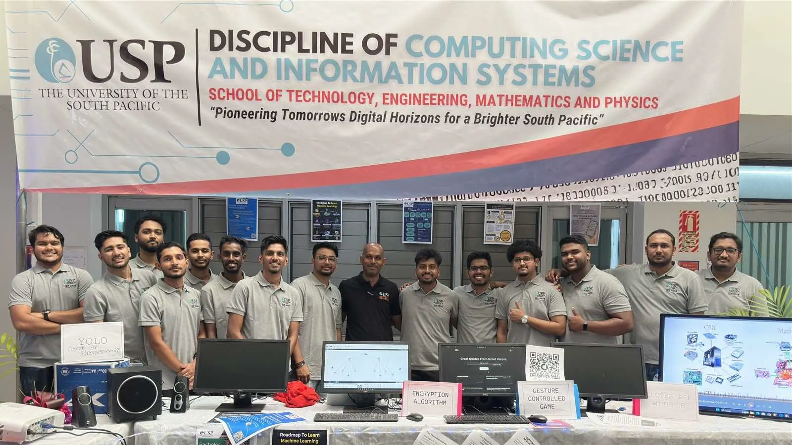

I proudly represented the Computer Science and Information Systems department by architecting, implementing and demonstrating a serverless full-stack [quote management](https://anav.dev/prjoects/great-quotes) web application.

I engaged with prospective students, explaining how frontends interact with backends and databases, and shared real-world insights on static websites vs. dynamic web applications.

 I designed  [eye-catching flyers](https://drive.google.com/drive/folders/1CaKiA3mc378NWjAZHhYV5pr90TeW1vI2?usp=drive_link) on popular video games and the modern technologies used to build them. I used Figma to design these flyers, blending creativity with my technical expertise.
