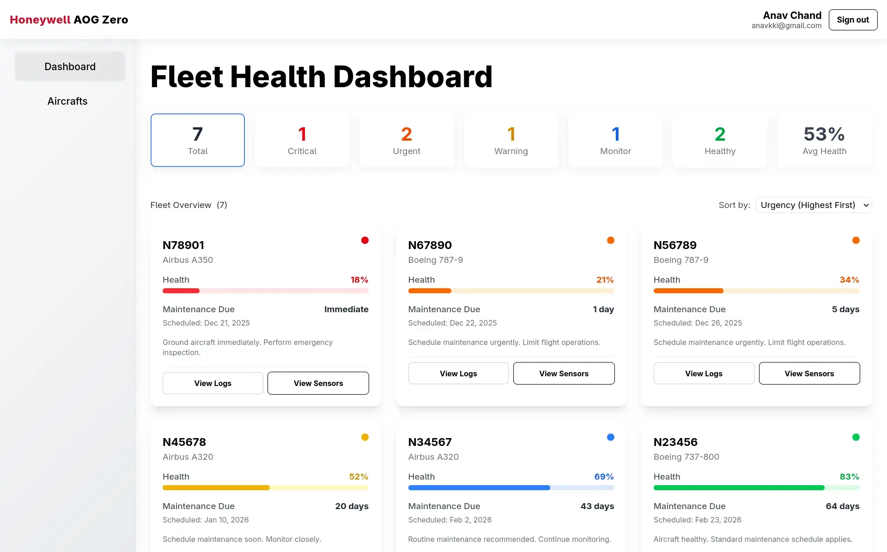

## Project Overview 

---

This is an Aircraft On Ground prevention system that monitors Auxiliary Power Units across a fleet. It was built as our solution for the [Honeywell Aerospace & TCS AI Hackathon](https://www.linkedin.com/posts/aanaav_aihackathon-appliedai-softwarearchitecture-ugcPost-7408422859645059072-H47d) held at the University of the South Pacific.



## Problem Statement 

---

Aircraft On Ground (AOG) events, often caused by component failures, lead to costly delays and disruptions. The [Auxiliary Power Unit](https://www.lot.com/is/en/explore/inspirations/aviation-trivia/apu-on-a-plane) (APU) is a frequent source of these issues, powering key systems when main engines are off. Maintenance is mostly reactive due to limited real-time health monitoring and scarce run-to-failure data. A proactive, data-driven approach that estimates Remaining Useful Life (RUL) early is needed to prevent AOG incidents through timely maintenance.

## Solution Architecture 

---

The system is built around a three-tier architecture that connects the ML pipeline, backend services, and frontend dashboard. The prediction model processes sensor data and generates RUL estimates, which are served through an API and stored in the database. The frontend then uses this data to visualize APU health and maintenance information.

```d2
*.style.border-radius: 6
*.*.style.border-radius: 6
*.style.fill: "#fff"
*.*.style.fill: "#fff"
*.style.font-color: "#444"
*.*.style.font-color: "#444"
*.style.double-border: false

Frontend: Dashboard

Backend: "" 
Backend.A: Auth & Routing
Backend.B: Business Logic
Backend.C: SQLAlchemy ORM

ML: "" 
ML.A: Feature Extraction
ML.B: PCA Health Indicator
ML.C: RUL Regression

DB: PostgreSQL 
APU: APU Sensors

Frontend -> Backend: HTTP Req {
  style: { animated: true } 
}

Frontend <- Backend: API Res {
  style: { animated: true } 
}

Backend.A -> Backend.B {
  style: { animated: true }
}

Backend.B -> Backend.C {
  style: { animated: true }
}

Backend.C -> DB {
  style: { animated: true }
}

APU -> ML.A {
  style: { animated: true }
}

ML.A -> ML.B {
  style: { animated: true }
}

ML.B -> ML.C {
  style: { animated: true }
}

ML.C -> Backend.B: RUL {
  style: { animated: true }
}
```

### Frontend 

---

Next.js is used to create a dashboard that allows users to view real-time APU health, browse maintenance logs and manage their fleet. Each type of sensor data is visualized using line charts powered by ReCharts.

### Backend

---

FastAPI exposes a REST API which allows the frontend to connect with the database and prediction model. The schema and queries for the database (PostgreSQL) are handled by SQLAlchemy.


### AI/ML 

---

A Python based prediction model was trained on simulated sensor datasets using Scikit-learn. This model predicts the APU's remaining useful life with an R<sup>2</sup> score of 0.97 and RMSE percentage of 12.76%.

### Infrastructure

---

The frontend, backend, and database are containerized using Docker and orchestrated using Docker Compose. The system was deployed on Azure VMs (for the duration of the hackathon) with a CI/CD pipeline using [Dokploy](https://dokploy.com).

## Feature Engineering

---

Six sensor channels were simulated with realistic noise and degradation patterns, then smoothed using moving averages and segmented into sliding windows representing health snapshots. For each window, key statistical features were extracted to capture drift, instability, and distribution changes linked to degradation. Features were combined, normalized with Z-score standardization, and reduced using PCA into a single Health Indicator representing the dominant degradation trend. This representation allowed a simple linear regression model to achieve strong performance. [Read more]().

## Project Results

---

The system provided accurate RUL predictions and clear fleet health insights, enabling proactive maintenance to prevent costly AOG events. Using simulated sensor data and ML-driven analysis, the system achieved strong predictive performance and earned 3rd place overall in the Honeywell & TCS AI Hackathon.
