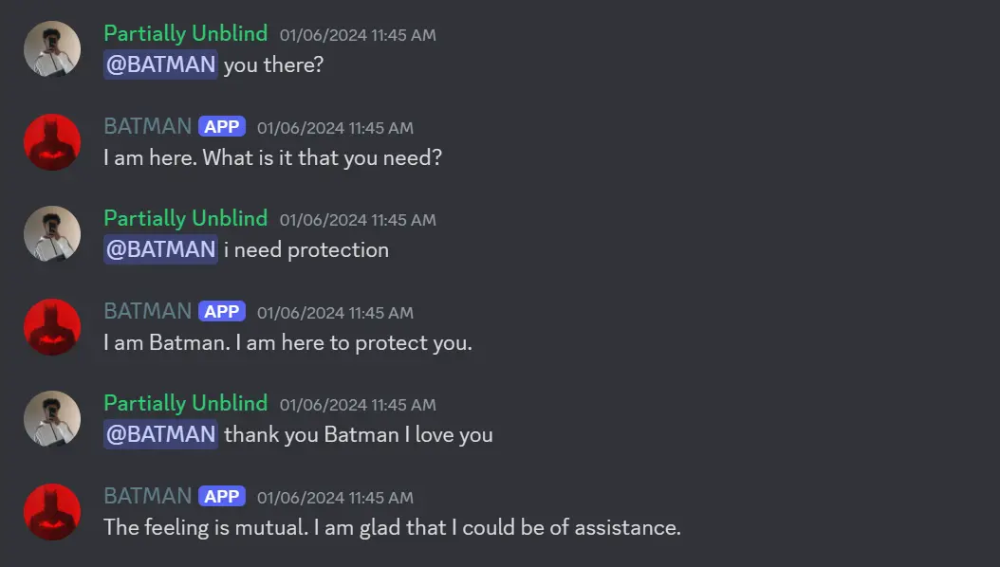

## Project Overview

---



This is a simple discord bot made using Google's Palm 2. The setup was easy and straightforward. This bot reads messages and replies to them as if it is Batman. If you want to talk to him, feel free to join the [Gotham City](https://discord.gg/K9rMzPudgS) discord server.

## User Manual

---

In order to prevent Batman from responding to every message, you need to mention him. To do so, simply type `@BATMAN` in the chat. Batman also comes with 2 slash commands:

**/batgif** - Get a random gif from the [Giphy API](https://developers.giphy.com/).

**/batquote** - Gets quote from hard coded quotes.

## Technologies Used

---

-   Node JS
-   Discord JS
-   Palm 2 API

## Getting Started

---

First, fork and clone the repo, and install all the required dependencies by running `npm install`. Then make a `.env` file in the root of your project and add the following variables:

```
PALM_AI_API_KEY
DISCORD_TOKEN
GIPHY_API_KEY
```

Finally Start the app by running `node index.js` or `node .`

## Learning Resources

---

-   [Creating an AI Discord bot](https://www.youtube.com/watch?v=VxD7Lt1eV2U)
-   [How to build a Discord bot](https://www.youtube.com/watch?v=Oy5HGvrxM4o)
-   [Discord JS docs](https://discord.js.org/)
