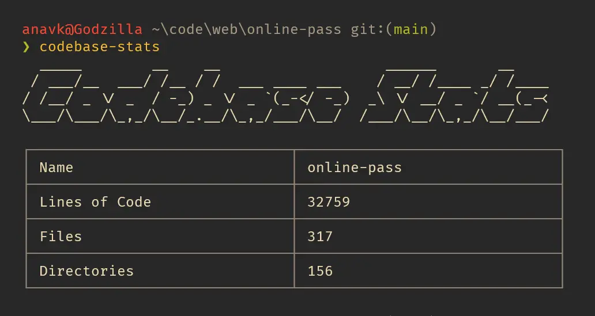

## Project Overview

---

[]()

This is a simple CLI tool that counts the number of directories, files and lines that code your codebase consists of using a recursive function. All `.files`, `.directories`, `images` and the `node_modules` are ignored.

## Technologies Used

---

-   Node JS
-   Typescript

## Getting Stated

---

Fist install the package:

```sh
npm i -g codebase-stats@latest
```

Then navigate to the project you want to get the stats for:

```sh
cd path/to/project
```

Finally, run the following command to get the stats:

```sh
codebase-stats
```

## Learning Resources

---

-   [TypeScript docs](https://www.typescriptlang.org)
-   [Node JS docs](https://nodejs.org/en)
-   [Tsup docs](https://tsup.egoist.dev)
