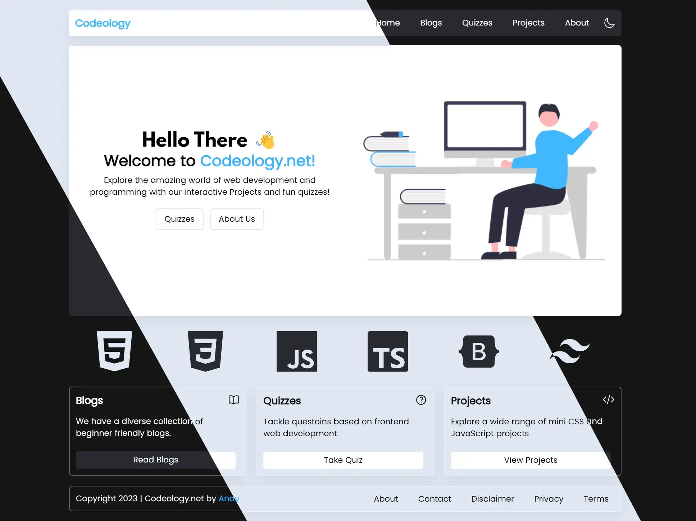

## Project Overview

---

This is a blog website I had made which also has a section for web development-related quizzes and live projects. The quizzes are coded using JavaScript and the projects are embedded using Fiddle JS. The blogs were created and managed using Netify CMS but I have switched to Frontmatter CMS. This is also the first time I bought a domain, .net.

## Technologies Used

---

-   Astro JS
-   Fiddle JS
-   TailwindCSS

## Getting Started

---

First fork and clone the repo. Then, run` npm install` to download all the dependencies. Once that is done, run `npm start` to view it on localhost.

## Learning Resources

---

-   [Everything about Astro](https://www.youtube.com/watch?v=rRxuVOutmFQ)
-   [Why use Astro?](https://www.youtube.com/watch?v=oQDErNNzdwU)
-   [Astro JS docs](https://astro.build/)
