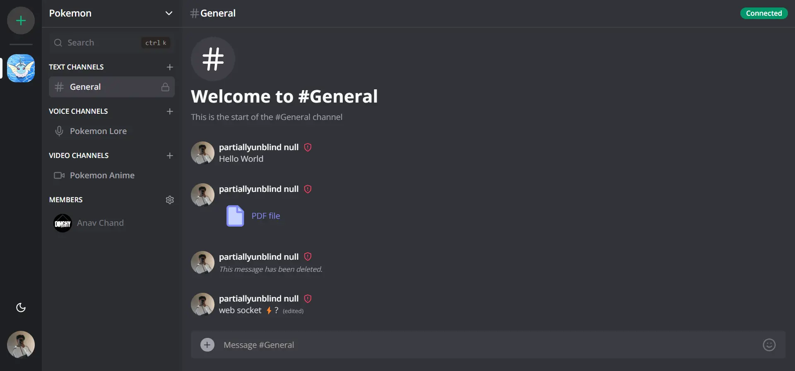

## Project Overview

---

[](https://github.com/anav5704/discord-clone)

This is a simple, fullstack Discord clone that has all the features of Discord other than Nitro. This includes real-time text, audio and video calls, file uploads, admin and moderator roles, and the creation and management of servers and channels. Real-time is made possible with socket IO and has polling as the fallback.

## Technologies Used

---

-   Next JS 13
-   Shadcn UI
-   TailwindCSS
-   Clerk
-   Prisma
-   Serverless PostgreSQL
-   Socket IO
-   LiveKit
-   Zustand
-   Zod

## Getting Started

---

First fork and clone the repo. Then, run `npm install` to download all the dependencies. Now, set up your environmental variables. Make a `.env` file in the root of your project with the following variables:

```zsh
NEXT_PUBLIC_CLERK_PUBLISHABLE_KEY="clerk-key"
CLERK_SECRET_KEY="clerk-secret"
NEXT_PUBLIC_CLERK_SIGN_IN_URL="/sign-in"
NEXT_PUBLIC_CLERK_SIGN_UP_URL="/sign-up"
NEXT_PUBLIC_CLERK_AFTER_SIGN_IN_URL="/"
NEXT_PUBLIC_CLERK_AFTER_SIGN_UP_URL="/"
DATABASE_URLDIRECT_URL="database-url"
UPLOADTHING_SECRET="uploadthing-secret"
UPLOADTHING_APP_ID="uploadthing-id"
LIVEKIT_API_KEY="livekit-key"
LIVEKIT_API_SECRET="like-secret"
NEXT_PUBLIC_LIVEKIT_URL="livekit-url"
```

Once that is done, run `npm run dev` to view it on localhost.

## Learning Resources

---

-   [Fullstack Discord clone with Next 13](https://www.youtube.com/watch?v=ZbX4Ok9YX94)
-   [Trillion messages on Discord](https://www.youtube.com/watch?v=U2xHdvvDQyI)
-   [Livekit docs](https://livekit.io/)
