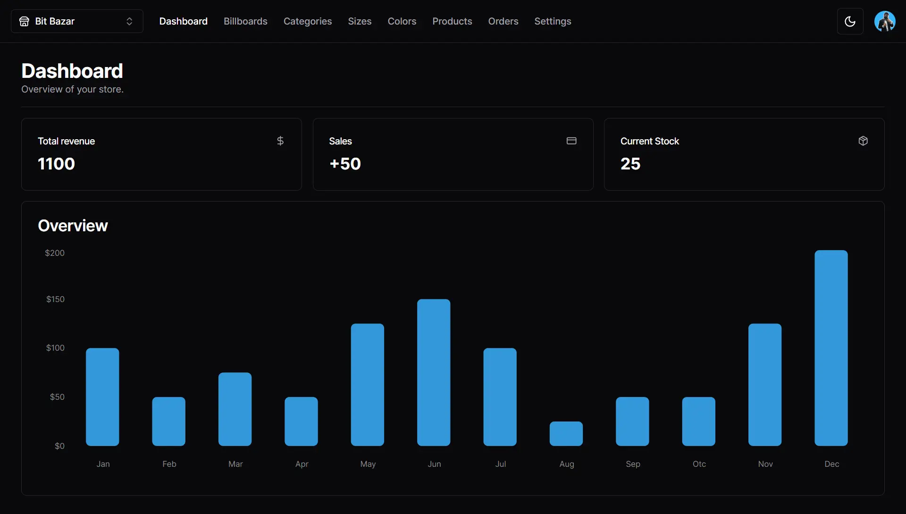

## E-commerce CMS

---

[](https://cms.anav.dev)

This is a simple content management system that acts as an [admin panel](https://cms.anav.dev), built to manage the [E-commerce store.](https://ecommerce.anav.dev) The store is literally an empty shell and all of the content is assigned by the CMS. Users can create and manage stores, billboards, categories, sizes, colors, and products. Orders are automatically created when a purchase is made in the store.

## Technologies Used

---

-   Next JS 14
-   TailwindCSS
-   Shadcn UI
-   Clerk
-   Cloudinary
-   Prisma
-   Neon PostgreSQL
-   Zustand
-   Zod
-   Stripe

## Getting Started

---

As per usual, fork and clone this repo and run `npm install` to download all the dependencies. Now set up the environment variables. The following will go in a `.env` in the root of your project.

```sh
NEXT_PUBLIC_CLERK_PUBLISHABLE_KEY="clerk-key"
CLERK_SECRET_KEY="clerk-secret"
NEXT_PUBLIC_CLERK_SIGN_IN_URL="/sign-in"
NEXT_PUBLIC_CLERK_SIGN_UP_URL="/sign-in"
NEXT_PUBLIC_CLERK_AFTER_SIGN_IN_URL="/"
NEXT_PUBLIC_CLERK_AFTER_SIGN_UP_URL="/"
DATABASE_URL="database-url"
NEXT_PUBLIC_CLOUDINARY_CLOUD_NAME="cloudinary-name"
STRIPE_API_KEY="stripe-key"
FRONTEND_STORE_URL="frontend-url"
```

Once set, you can run `npm run dev` to see it live on your localhost.

## Learning Resources

---

-   [Fullstack E-commerce + dashboard and CMS](https://www.youtube.com/watch?v=5miHyP6lExg)
-   [Headless UI docs](https://headlessui.com/)
-   [Next JS docs](https://nextjs.org/)
