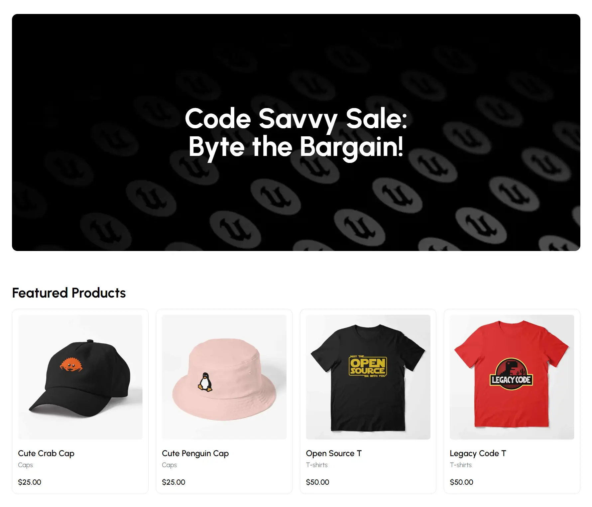

## Project Overview

---

[](https://ecommerce.anav.dev)

This is a simple [e-commerce store](https://ecommerce.anav.dev) that is fully managed by a [custom built CMS](https://cms.anav.dev). Every piece of information displayed on this website is managed by the CMS and is fetched on request. Cart functionality is made using Zustand and payments are done using Stripe.

## Technologies Used

---

-   Next JS 14
-   TailwindCSS
-   Headless UI
-   Stripe
-   Zustand

## Getting Started

---

First fork and clone the repo. Then, run `npm install` to download all the dependencies. Now, set up your environmental variables. Make a `.env` file in the root of your project with the following variable(You will have to get this from the settings page in your respective store on the admin website):

```sh
NEXT_PUBLIC_API_URL="api-url"
```

The other and last thing you have to change is the parameter to the getBillboard function in `app/(routes)/page.tsx`

```ts
const billboard = await getBillboard("billboard-id");
```

Once that is done, run `npm run dev` to view the store on localhost.

## Learning Resources

---

-   [Fullstack E-commerce + dashboard and CMS](https://www.youtube.com/watch?v=5miHyP6lExg)
-   [Headless UI docs](https://headlessui.com/)
-   [Next JS docs](https://nextjs.org/)
