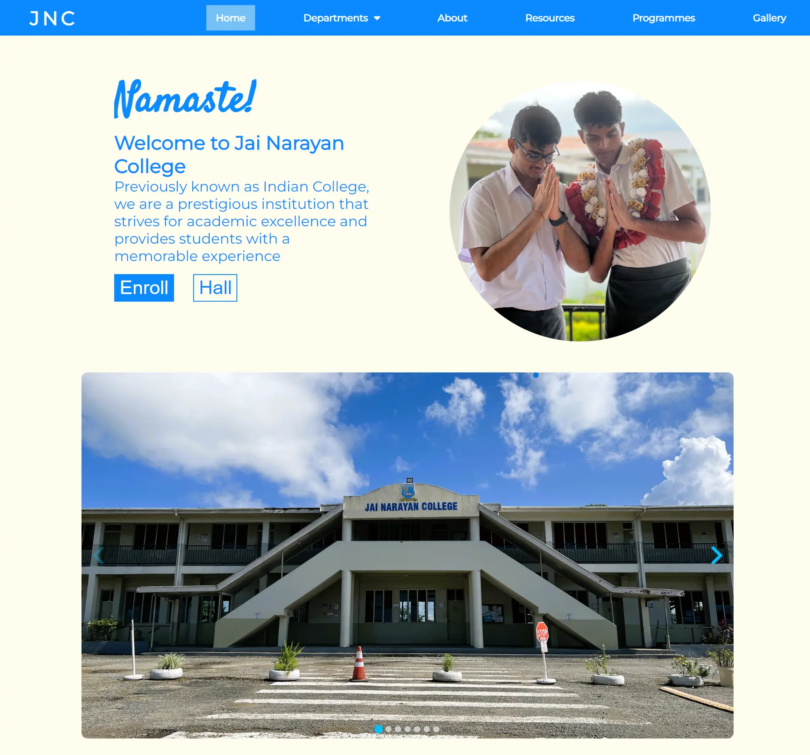

## Project Overview

---

**Disclaimer:** This is unofficial and not affiliated with JNC.

This is a simple concept website made for JNC as a part of my highschool final-year computer project. It was made over the span of 3 months and turned out great for my first-ever website. My teachers and friends really liked it and this experience made me fall in love with web development.

## Technologies Used

---

-   HTML
-   CSS
-   JavaScript

## Getting Started

---

Make sure you have the `live server` extension installed in VS Code. Then fork and clone the repo. This might take some time as there are a lot of high-quality images in here. Once cloned, just fire up the live server and enjoy.

## Learning Resources

---

-   [HTML & CSS crash course](https://www.youtube.com/watch?v=C5QFHp1oAws)
-   [Kevin Powell - The CSS god](https://www.youtube.com/@KevinPowell)
-   [That weird JavaScript course](https://youtube.com/playlist?list=PL0vfts4VzfNixzfaQWwDUg3W5TRbE7CyI&si=4MbDrWANpBb23RYT)
