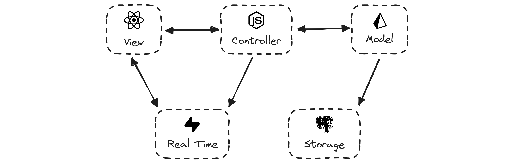
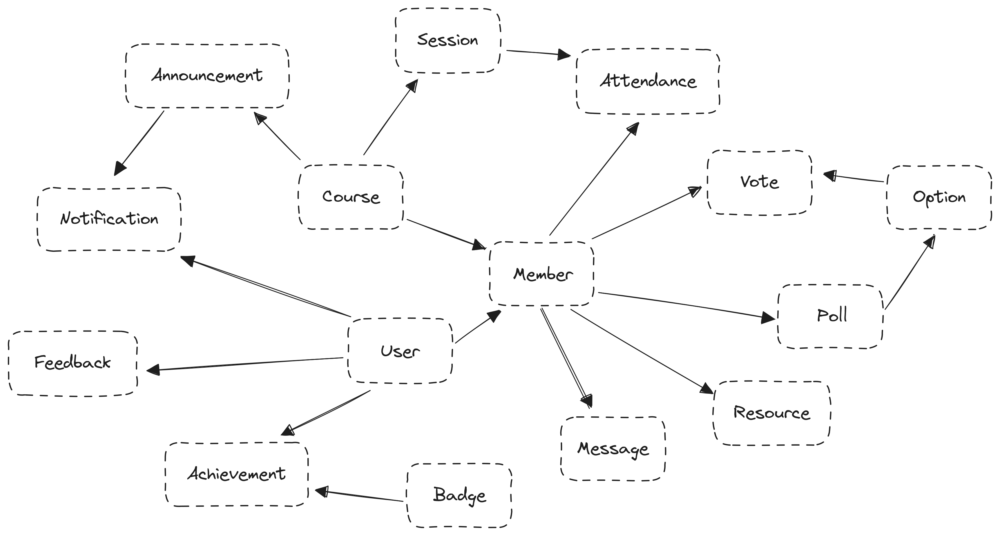

Online PASS is a real-time, full-stack progressive web application designed to streamline and enhance PASS (University of the South Pacific's Peer Aided Study Sessions). It consolidates features from Viber and Zoom, offering functionalities such as chat rooms, audio/video calls, session schedules, worksheet submissions, and resource access. OPASS also boasts a plethora of badges to earn and a leader board to showcase the best students and leaders.

## Technologies Used

- Next JS
- TailwindCSS
- Next UI
- Shadcn UI
- Lucide Icons
- Prisma
- AWS RDS
- AWS S3
- Supabase
- MS Azure AD
- Resend
- React Email

## Features

**Chat** - students can send messages, edit them, delete them and reply to other messages.

**Polls** - students can add polls with multiple options and course members can cast their votes.

**Submissions** - students can share with their peers and submit worksheet answers for marking.

**Resources** - leaders can share resources in the form of uploading worksheets or linking sites.

**Schedule** - students can view the scheduled sessions for the week and leaders can manage them.

**Attendance** - leaders can take attendance for sessions from within the app, no more sheets!.

**Announcements** - admins and leaders can send global / course scoped messages to members.

**Notifications** - alerts will be sent out to students on certain events such as session cancellation.

**Achievements** - students can earn badges for completing certain tasks and reaching milestones.

**Leaderboards** - students and leaders with high engagement and contribution get added here.

**Dashboard** - admins and leaders have access to a powerful dashboard with vital information.

**Feedback Friday** - students can share their experiences, report bugs or request features on Fridays.

**Turbo Keys** - all internal app and course navigation links have a custom shortcut bound to them.

## Architecture

The PASS web app adopts a 3-layer MVC architecture, leveraging modern and open-source technologies. In the model layer, Prisma serves as the ORM for data management, interfacing with a PostgreSQL database hosted on AWS RDS, while AWS S3 handles object storage. React JS is utilized in the view layer for creating a dynamic user interface, with Next UI and Shadcn UI providing accessible and customizable components. For interconnection, Next JS acts as the framework, utilizing its built-in server to handle API functionalities, while Supabase serves as the real-time server, offering services such as web sockets for enhanced interactivity.

## Data Models

This schema outlines the structure of OPASS where every Course related model roots back up to the Member. The Member model was chosen to be the main entity as deleting it will delete every model that has a relationship to it in a cascading manner. This prevents there being any ghost entries laying in the database after a Member is removed from a Course. All in all, these models provide the foundation for a robust system supporting various educational and collaborative activities.

## Useful Links

- [Technical Documentation](https://drive.google.com/drive/folders/1XW6U5settBGV54-f01Ec4AwTMIZdd1CF?usp=sharing)
- [General Documentation](https://usp-online-pass.onrender.com/geenral-docs)
- [User Manual](https://usp-online-pass.onrender.com/user-manual)
