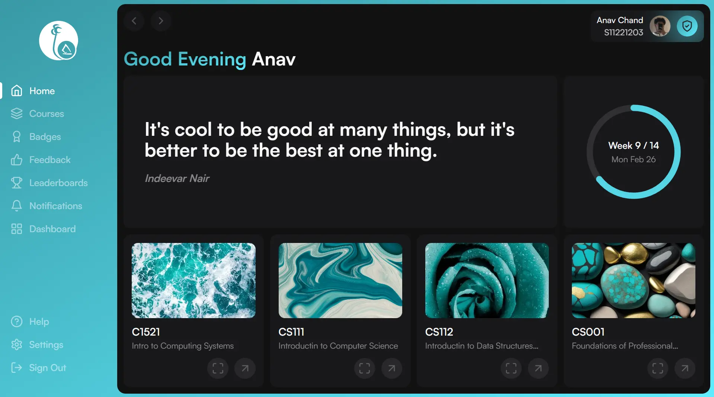
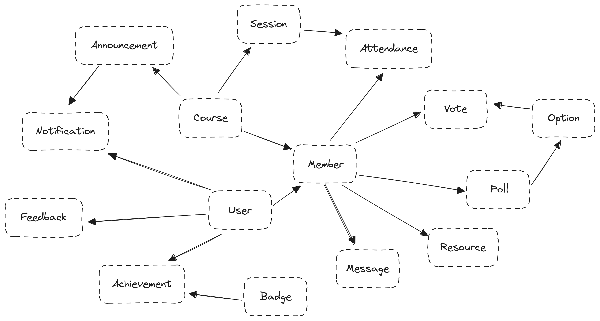

## Project Overview

---

[The University of the South Pacific](https://usp.ac.fj) (USP) provijdes a robust technological ecosystem for learning, including Student Online Services (SOLS), Information Technology Services (ITS), Moodle integration, and Sem 0 GPT. USP also offers programs like PASS (peer aided study sessions) where students collaborate under the guidance of high-achieving peers.

## The Problem

---

There are challenges with managing various technologies for PASS leaders and ensuring student participation due to the need for Viber and Zoom installations, issues with Viber file storage, and time limitations on Zoom calls. These issues affect the efficiency of the system for both leaders and students.

## The Solution

---

Online PASS! A real-time, full-stack progressive web application designed to streamline and enhance PASS. It will consolidate features from Viber and Zoom, offering functionalities such as chat rooms, audio/video calls, session schedules, worksheet submissions, and resource access. OPASS also boasts a plethora of badges to earn and a leader board to showcase the best students and leaders.

## Technologies Used

---

-   Next JS
-   TailwindCSS
-   Next UI
-   Shadcn UI
-   Lucide Icons
-   Prisma
-   AWS RDS
-   AWS S3
-   Supabase
-   MS Azure AD
-   Resend
-   React Email

## Features

---

**Chat** - students can send messages, edit them, delete them and reply to other messages.

**Polls** - students can add polls with multiple options and course members can cast votes.

**Submissions** - students can share with their peers and submit worksheets for marking.

**Resources** - leaders can share resources by uploading worksheets or linking sites.

**Schedule** - students can view the scheduled sessions and leaders can manage them.

**Attendance** - leaders can take directly attendance for sessions from within the app.

**Announcements** - admins and leaders can send scoped messages to course members.

**Notifications** - alerts will be sent out to students on events such as session cancellation.

**Achievements** - students can earn badges by completing tasks and reaching milestones.

**Leaderboards** - list of students and leaders with high engagement and contribution.

**Dashboard** - admins and leaders have access to a powerful dashboard with vital info.

**Feedback Friday** - students can share their experiences and report bugs on Fridays.

**Turbo Keys** - internal app and course navigation links have shortcuts bound to them.

## Architecture

---

The PASS web app adopts a 3-layer MVC architecture, leveraging modern and open-source technologies. In the model layer, Prisma serves as the ORM for data management, interfacing with a PostgreSQL database hosted on AWS RDS, while AWS S3 handles object storage. React JS is utilized in the view layer for creating a dynamic user interface, with Next UI and Shadcn UI providing accessible and customizable components. For interconnection, Next JS acts as the framework, utilizing its built-in server to handle API functionalities, while Supabase serves as the real-time server, offering services such as web sockets for enhanced interactivity.

## Data Models

---

This schema outlines the structure of OPASS where every Course related model roots back up to the Member. The Member model was chosen to be the main entity as deleting it will delete every model that has a relationship to it in a cascading manner. This prevents there being any ghost entries laying in the database after a Member is removed from a Course. All in all, these models provide the foundation for a robust system supporting various educational and collaborative activities.

## Useful Links

---

-   [Technical Documentation](https://drive.google.com/drive/folders/1XW6U5settBGV54-f01Ec4AwTMIZdd1CF?usp=sharing)
-   [General Documentation](https://usp-online-pass.onrender.com/geenral-docs)
-   [User Manual](https://usp-online-pass.onrender.com/user-manual)
