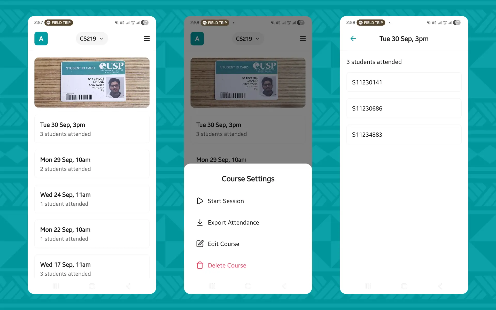

## Project Overview

---

This is a mobile attendance tracking app built for [PASS (Peer Assisted Study Sessions)](https://www.usp.ac.fj/usp-stemp/sls-student-learning-support) leaders at the University of the South Pacific. The app lets leaders to quickly and accurately record attendance by scanning student ID cards. 

## Project Motivation

---

PASS leaders facilitate group study sessions for students enrolled in challenging courses. A key part of their role involves taking attendance at each session and submitting records to the PASS Coordinator. The traditional manual process of recording attendance was slow, error-prone, and tedious. 

Having served as a PASS leader for three courses, I encountered these challenges myself. To address them, I developed PASSport, which enables leaders to take attendance in seconds by scanning student IDs.

## Project Details

---

PASSport is built with React Native and Expo, targeting Android devices. The app follows a file-based routing structure using Expo Router and features a clean, minimal UI that respects the user's system theme (light/dark mode). The core features of this app include:

**Barcode Scanning** - The camera-based scanner validates student IDs and signature barcodes. A two-step scan flow ensures authenticity, first the student ID, then the matching signature.

**Session Management** - Leaders can start sessions for their courses. The app prevents duplicate sessions within the same hour and tracks attendance counts for each session.

**Course Management** - Leaders can add, edit, delete, and switch between multiple courses they are leading.

**Attendance Export** - Data can be exported to password-protected Excel files with SHA-256 checksums for integrity verification, ready for submission to coordinators.

**Offline Support** - All data is stored locally using SQLite with Drizzle ORM, requiring no internet connection during sessions.

## Project Outcomes

---

PASSport successfully digitizes the attendance workflow for PASS leaders. The two-step barcode scan (ID + signature) adds a layer of verification that prevents students from marking attendance for others. The offline-first architecture ensures the app works reliably during study sessions regardless of network conditions. The Excel export feature with password protection and checksums provides coordinators with tamper-evident records.

Leaders in STEMP and I ran a parallel approach by using PASSport alongside the existing attendance process during the second semester of 2025. This allowed the system to be evaluated in real sessions. As a result, PASSport is now in the works to be adopted full-time in first semester of 2026, with me leading student training and onboarding for the app.
