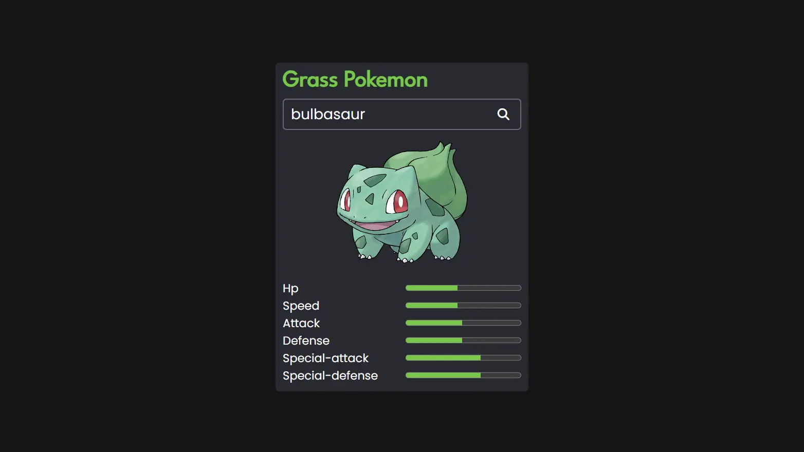

## Project Overview

---

This is a simple Pokemon search app made using the PokeAPI. I made this back then when I was learning JavaScript. Was very excited to work with an API and being able to use fetch was like a mini dream come true.

## Technologies Used

---

-   HTML
-   CSS
-   JavaScript
-   PokeAPI

## Getting Started

---

Make sure you have the `live server` extension installed in VS Code. Then fork and clone the repo. Once cloned, just fire up the live server and enjoy.

## Learning Resources

---

-   [JS fetch API tutorial for beginners](https://www.youtube.com/watch?v=ubw2hdQIl4E)
-   [How to fetch data from an API](https://www.youtube.com/watch?v=zOrejGF0oBA)
-   [PokeAPI docs](https://pokeapi.co/)
