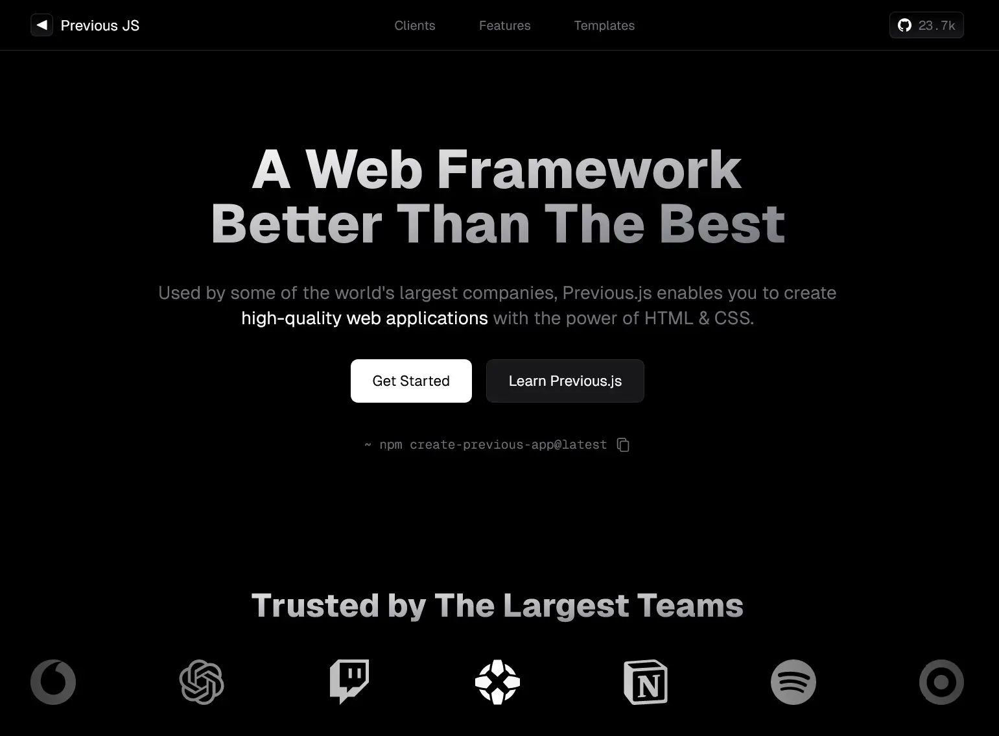

## Project Overview

---

This is a simple landing page I made for `previous.js`, which isn't a real thing. The main idea was to attempt to make a modern and clean website, similar to modern web frameworks and products.

The aesthetic is heavily inspired by the [Next.js](https://nextjs.org) website - black, white and [Geist Sans](https://vercel.com/font). This project is a NX monorepo and all the components are in the `libs/shared/ui` folder. This has no main purpose - I was just trying it out.

## Technologies Used

---

-   Next JS 14
-   TailwindCSS
-   NX monorepo

## Getting Started

---

First fork and clone the repo. Then, run `npm install` to download all the dependencies. Once that is done, run `npx nx run web:dev` to view it on localhost.

## Learning Resources

---

-   [TailwindCSS docs](https://tailwindcss.com)
-   [Next JS docs](https://nextjs.org/)
-   [NX docs](https://nx.dev/)
