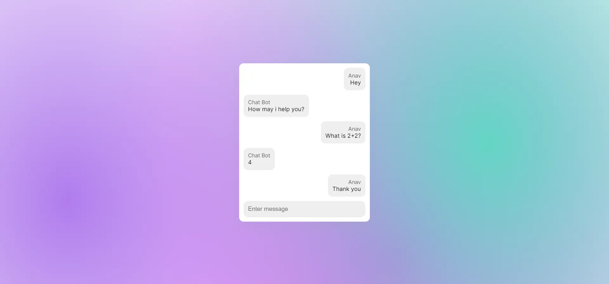
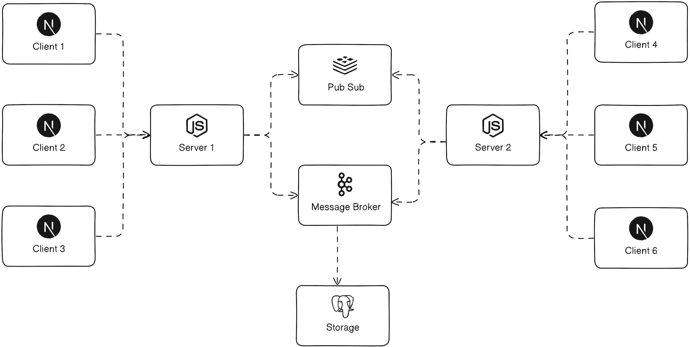

## Project Overview

---

[](https://scaleable-chat.anav.dev/)

**Disclaimer**: Live preview might not work but code is fully functional.

This a simple real-time chat app made to be both vertically and horizontally scalable. Scaling web sockets is hard, but it is made easy through the use of a Redis server. In this app, users can only send and receive messages in a global chat room. Using Redis makes this extremely fast and truly real-time.

## Technologies Used

---

-   Next JS
-   Node JS
-   Kafka
-   Redis
-   PostgreSQL
-   Prisma
-   Socket IO
-   Turbo Repo

## Hosting

---

There are 5 main parts to this project, the Next JS app, the Node JS server, the Redis server, the Kafka message broker, and PostgreSQL. The Next JS app is hosted on [Vercel](https://vercel.com/dashboard), the Node JS server is hosted on [Render](https://render.com/), and Redis, Kafka, and PostgreSQL are fully managed by [Aiven](https://aiven.io/redis). All of these have free tiers so feel free to check them out.

## Architecture

---



This project incorporates both a client/server architecture and a pub/sub architecture. The Node JS server, which uses web sockets to listen for users connecting to the server, subscribes them to the Redis server on load. When a user sends a message, the web sockets pick it up and publish it to the Redis server which broadcasts it to all connected clients(regardless of which Node JS server published it).

In this new version, the message is sent to the Kafka producer after it is emitted by the web sockets. The producer then sends the message to a `MESSAGES` topic. The Kafka consumer subscribes to this topic when the server first starts and stores messages in a PostgreSQL database, one at a time. This consumer also has a 1-minute cool down if something goes wrong with the database. We are using Kafka instead of directly writing to the database as it has a significantly higher throughput.

## Getting Started

---

First fork and clone the repo. First run `npm install` to download all the dependencies. Now, set up your environmental variables. Make a `.env` file in `apps/server` with the following variable(this is from your Aiven Redis project):

```sh
REDIS_PASSWD="redis-password"
KAFKA_PASSWD="kafka-password"
DATABASE_URL="database-url"
```

Also, update the Redis config in `apps/server/src/services/socket.ts` and the Kafka constructor in `apps/server/src/services/kafka.ts` with the information provided by Aiven. In addition to this, be sure to change the web socket URL in the `socketProvider` with either `localhost:8000` or the hosted url of your server. Once all of this is set up, cd back up into the root of your project and run `npm run dev` so start up both the Next JS app and Node JS server.

## Learning Resources

---

-   [Scalable Realtime Chat App](https://www.youtube.com/watch?v=CQQc8QyIGl0)
-   [WebSockets in 100 seconds](https://www.youtube.com/watch?v=1BfCnjr_Vjg)
-   [What are monorepos?](https://www.youtube.com/watch?v=9iU_IE6vnJ8)
