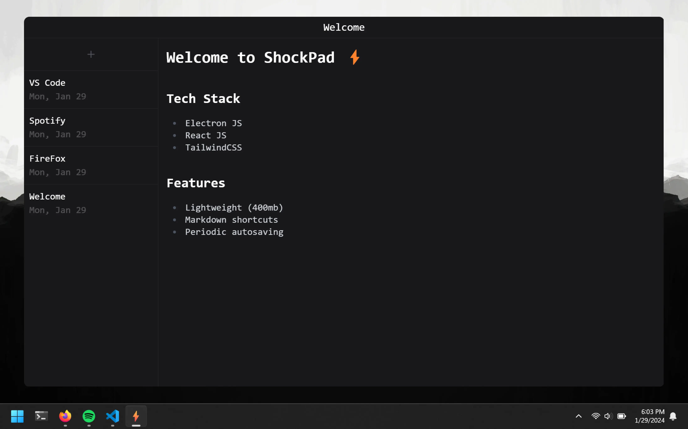

## Project Overview

---

This is a simple, native desktop note app for Windows. This app features markdown shortcuts and periodical auto saving. All the notes are saved as markdown files in the users file system in `C:/Users/<username>/notes`. Deleting files also permanently removed the file from disk.

## Technologies Used

---

-   Electron JS
-   React JS
-   TailwindCSS
-   Jotai

## Getting Started

---

First, fork and clone the repo, and install all the required dependencies by running `npm install`. You can view the app on localhost by running `npm run dev`. Alternatively, you can run ` npm run build:win` to build it and the ShockPad installer can be found in `dist/ShockPad-1.0.0-setup.exe`. Running this will install the app onto your machine.

## Learning Resources

---

-   [Build a notes app with Electron](https://www.youtube.com/watch?v=t8ane4BDyC8)
-   [Electron JS docs](https://www.electronjs.org/docs/latest)
-   [React JS docs](https://legacy.reactjs.org/docs/getting-started.html)
