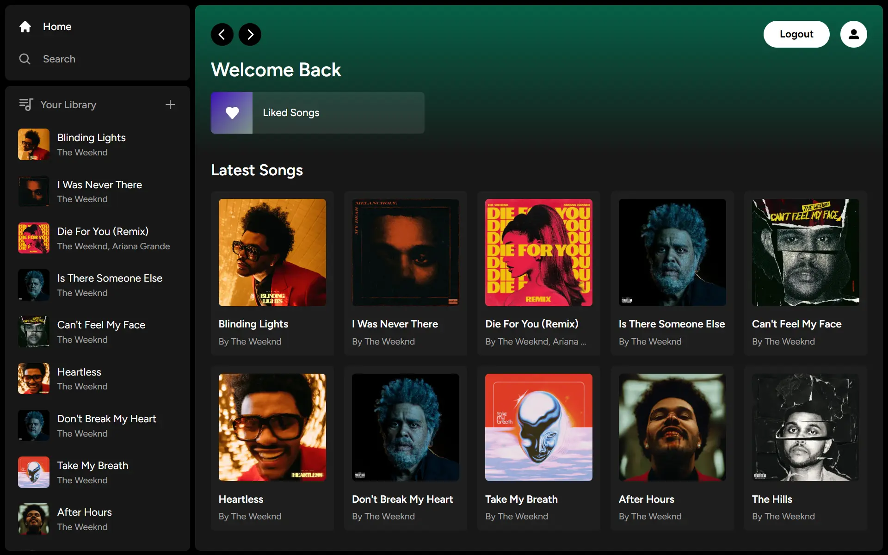

## Project Overview

---

[](https://spotify.anav.dev)

This is a simple, full-stack Spotify clone but without premium. Users can add their own music to their library and this will be available to all signed-in users. Users can also like songs and search for songs.

## Technologies Used

---

-   Next JS 13
-   TailwindCSS
-   Radix UI
-   Supabase
-   Zustand

## Getting Started

---

First fork and clone the repo. Then, run `npm install` to download all the dependencies. Now, set up your environmental variables. Make a `.env.local` file in the root of your project with the following variables(these are from your Supabase project):

```sh
NEXT_PUBLIC_SUPABASE_URL
NEXT_PUBLIC_SUPABASE_ANON_KEY
SUPABASE_SERVICE_ROLE_KEY
```

Once that is done, run `npm run dev` to view it on localhost.

## Learning Resources

---

-   [Next JS + Supabase web app](https://www.youtube.com/watch?v=kDGovtwtcyU)
-   [Fullstack Spotify clone](https://www.youtube.com/watch?v=2aeMRB8LL4o)
-   [Supabase docs](https://supabase.com/)
