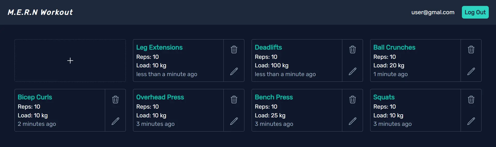

## Project Overview

---

[](https://github.com/anav5704/Workout-App-MERN)

This is a simple web app made to keep track of a user's fitness journey. Users can log in or sign up and then perform CRUD operations on workout entities. User passwords are salted and hashed before being stored in MongoDB. This was my first ever MERN app and I almost quit halfway through as I was lost but I managed to finish it with a decent end result.

## Technologies Used

---

-   React JS
-   Express JS
-   Node JS
-   MongoDB
-   Mongoose

## Getting Started

---

First fork and clone the repo. First, run `npm install` in both the frontend and backend directories to download all the dependencies. Now, set up your environmental variables. Make a `.env` file in the backend of your project with the following variables(SECRET can be any 8-character long string):

```sh
PORT=4000
MONGO
SECRET
```

Once that is done, run `npm start` in both the frontend and backend directories to view it on localhost.

## Learning Resources

---

-   [MERN stack crash course](https://www.youtube.com/watch?v=98BzS5Oz5E4&list=PL4cUxeGkcC9iJ_KkrkBZWZRHVwnzLIoUE)
-   [Tech stacks explained](https://www.youtube.com/watch?v=Sxxw3qtb3_g)
-   [React JS in 100 seconds](https://www.youtube.com/watch?v=Tn6-PIqc4UM)
