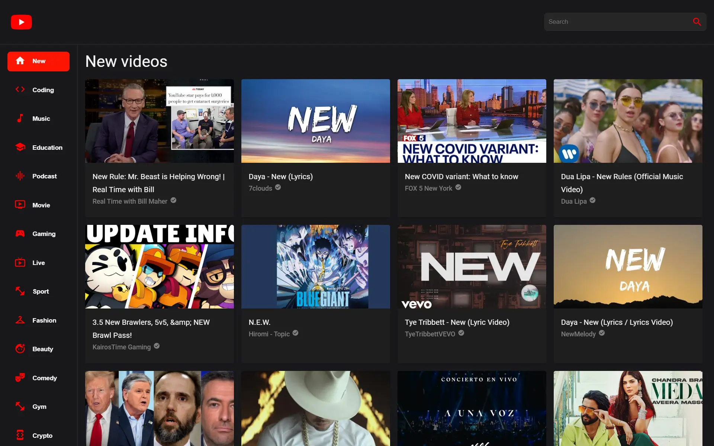

## Project Overview

---

[](https://youtube.anav.dev)

This is a simple recreation of YouTube. It has a sidebar with various categories and a search page that fetches data from a search endpoint on Rapid APIs YouTube API. This was my first time working with Rapid API and it was an ok experience. The free tier has a pretty low quota limit though and I exceeded it many times.

## Technologies Used

---

-   React JS
-   Material UI 5
-   Rapid API

## Getting Started

---

First fork and clone the repo. Then, run `npm install` to download all the dependencies. Now, set up your environmental variables. Make a `.env` file in the root of your project with the following variable(this is the Rapid API key - YouTube v3):

```sh
API_KEY
```

Once that is done, run `npm start` to view it on localhost.

## Learning Resources

---

-   [YouTube clone tutoriral](https://www.youtube.com/watch?v=FHTbsZEJspU)
-   [Material UI docs](https://mui.com/)
-   [Rapid API docs](https://rapidapi.com/hub)
